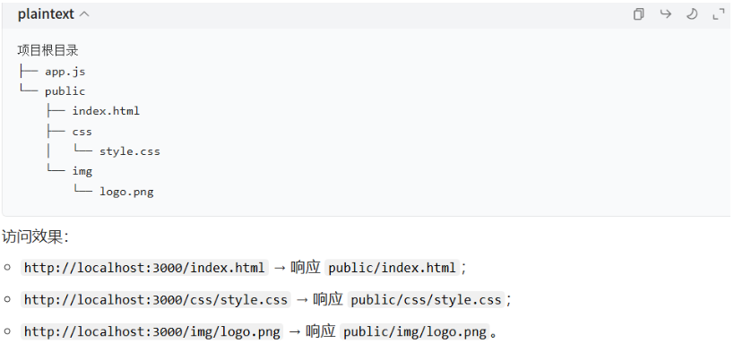

静态资源：长时间不发生改变

Express 中的**静态资源中间件**（`express.static`）是专门用于托管「静态文件」的内置中间件，核心作用是让服务器能够直接响应客户端对图片、CSS、JS、HTML、字体等静态资源的请求，无需手动编写路由处理。

```javascript
app.use(express.static('public'));
```



自动找index.html（网站首页）可能和其他路由冲突